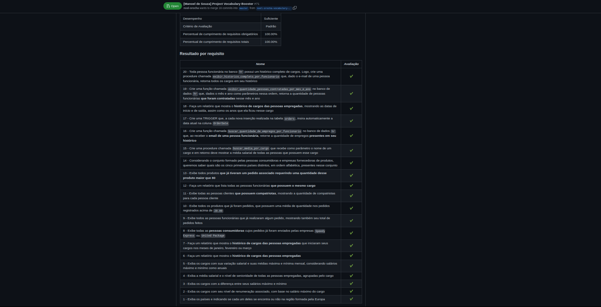

# Project MySQL Vocabulary Booster

### The Assignment

Today you will do a project with the codename _Vocabulary Booster_, in which you will explore all the concepts seen so far about **SQL**.

The challenges of this project were created in order to provide means for you to practice creating more elaborate queries, often using different commands in the same query.

In this project you will use two databases: the `hr` and a new one called `w3schools`. Instructions on how to restore the bank can be read below.

### Skills to be Tested

In this project, I was able to:

  * Create conditionals in **SQL** using **IF** and **CASE**

  * Handle _strings_ in **SQL**

  * Use the various **MySQL** math functions

  * Extract specific information about dates from a table

  * Use the aggregation functions **AVG**, **MIN**, **MAX**, **SUM** and **COUNT**

  * View and filter data in a grouped way with **GROUP BY** and **HAVING**

  * Use **INNER JOIN**, **LEFT JOIN**, **RIGHT JOIN** to combine data from two or more tables

  * Use **SELF JOIN** to join a table with itself

  * Use SUBQUERIES

  * Create more efficient queries through EXISTS

  * Assemble reusable **SQL** code blocks with **STORED PROCEDURES** and **STORED FUNCTIONS**

### Evaluator Results

#### Disclaimer

This assignment was developed by [Trybe](https://www.betrybe.com) in order to test my skills using SQL code and MySQL.